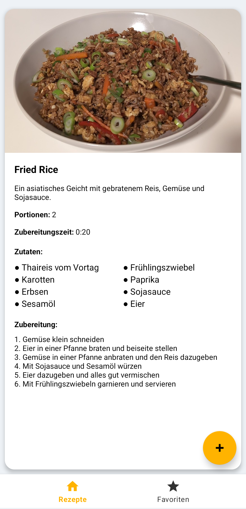
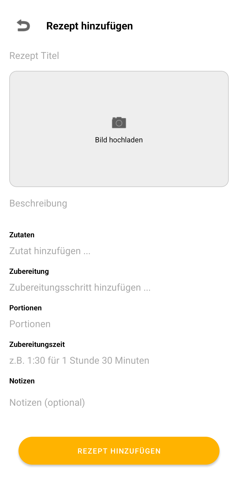
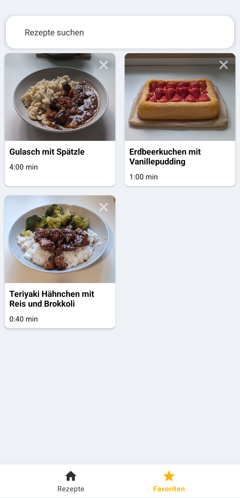
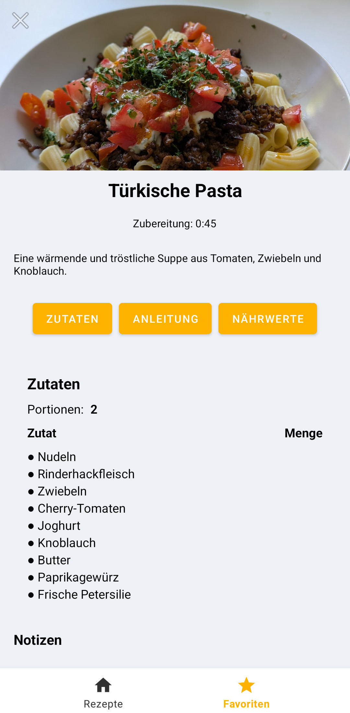

# MealPlanner

MealPlanner ist eine moderne Android-App, mit der du deine Lieblingsrezepte einfach verwalten, planen und teilen kannst. Die App bietet eine intuitive Benutzeroberfläche zum Hinzufügen, Bearbeiten und Anzeigen von Rezepten – inklusive Zutaten, Zubereitungsschritten, Bildern, Portionsangabe und Notizen.

## Features

- **Rezepte hinzufügen und bearbeiten:** Erstelle neue Rezepte mit Titel, Beschreibung, Bild, Zutaten, Zubereitungsschritten, Portionen, Zubereitungszeit und Notizen.
- **Dynamische Zutaten- und Zubereitungsliste:** Füge Zutaten und Schritte flexibel hinzu, verschiebe sie per Drag & Drop und lösche sie bei Bedarf.
- **Rezept-Detailansicht:** Zeigt alle Informationen zu einem Rezept übersichtlich an – inklusive Portionsgröße und Notizen.
- **Favoriten:** Markiere Rezepte als Favoriten und greife schnell darauf zu.
- **Bildergalerie:** Lade eigene Fotos zu deinen Rezepten hoch.
- **Intuitive Bedienung:** Die App ist für Smartphones optimiert und bietet ein modernes, klares Design.

## Installation

1. Klone das Repository:
   ```
   git clone <repo-url>
   ```
2. Öffne das Projekt in Android Studio.
3. Baue und starte die App auf deinem Gerät oder Emulator.

## Screenshots





*Hier kannst du später Fotos der App einfügen.*

## Projektstruktur

- **app/src/main/java/com/app/mealplanner/**  – Hauptlogik, Fragments, Adapter und Models
- **app/src/main/res/layout/**  – XML-Layouts für die verschiedenen Ansichten
- **app/src/main/res/drawable/**  – Icons und Hintergründe
- **app/src/main/res/values/**  – Farben, Strings und Styles

## Wie funktioniert der Code?

Die App ist modular aufgebaut und nutzt moderne Android-Architekturprinzipien:

- **Fragments:** Die Hauptansichten (z.B. Rezeptübersicht, Rezeptdetails, Dialog zum Hinzufügen) sind als Fragments umgesetzt und werden dynamisch angezeigt.
- **Adapter:** Zutaten und Zubereitungsschritte werden über RecyclerView-Adapter verwaltet. Die Adapter unterstützen Drag & Drop und das Löschen von Einträgen.
- **Model-Klassen:** Rezepte werden als eigene Model-Klasse (Recipe) gespeichert. Die Daten werden als JSON-Dateien im internen Speicher abgelegt und beim Start geladen.
- **Dialoge:** Neue Rezepte werden über einen Dialog (AddRecipeDialogFragment) hinzugefügt. Die Eingabefelder sind dynamisch und die Listen werden direkt aktualisiert.
- **Favoriten:** Favorisierte Rezepte werden in einer eigenen Datei gespeichert und können schnell angezeigt werden.
- **Bilder:** Bilder werden im internen Speicher abgelegt und als relativer Pfad im Rezept gespeichert.
- **UI/UX:** Die App verwendet ein modernes, responsives Layout mit Material Design Komponenten. Der "Rezept hinzufügen"-Button bleibt immer sichtbar und wird bei geöffneter Tastatur ausgeblendet.

Die Kommunikation zwischen den Komponenten erfolgt über Listener und direkte Datenübergabe. Die App ist so gestaltet, dass sie einfach erweitert und angepasst werden kann.

## Lizenz

Dieses Projekt steht unter der MIT-Lizenz.
