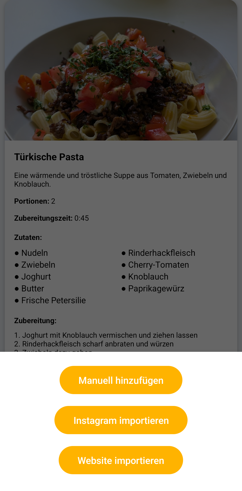
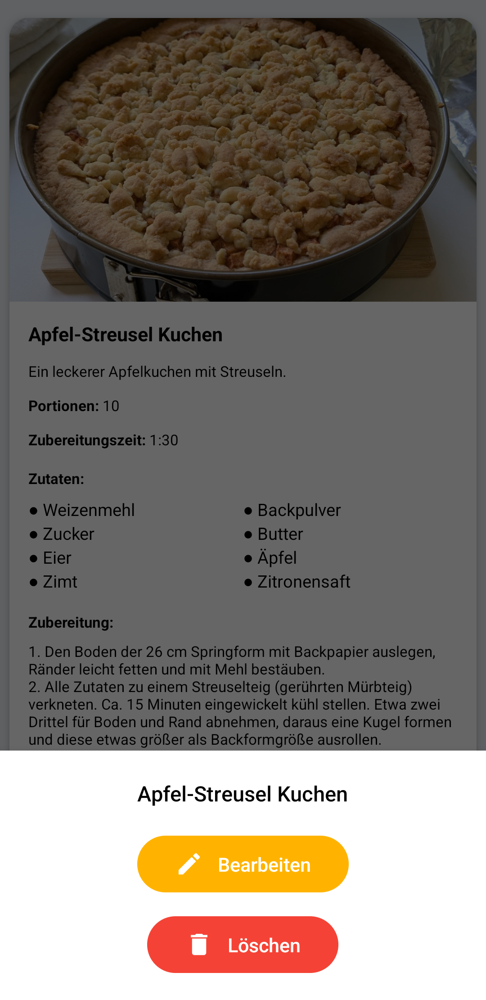

<div align="center">
  
  <h1>MealPlanner 🍽️</h1>
  <p><em>Eine moderne Android-App zur Verwaltung deiner Rezepte – jetzt mit <strong>KI-Unterstützung</strong>!</em></p>
</div>

## Features

### 🧠 **KI-gestützte Rezept-Erstellung**
- **Instagram-Import:** Importiere Rezepte direkt aus Instagram-Posts mit KI-Analyse
- **Website-Import:** Extrahiere Rezepte automatisch von beliebigen Websites 
- **Intelligente Texterkennung:** Die KI erkennt und strukturiert automatisch Zutaten, Zubereitungsschritte und weitere Details

### 📱 **Kernfunktionen**
- **Rezeptverwaltung:** Erstelle, bearbeite und lösche deine eigenen Rezepte
- **Lange-Drücken-Menü:** Halte Rezepte lange gedrückt für Bearbeitungs- und Löschoptionen
- **Intelligente Bildbearbeitung:** Integrierter Bild-Crop-Editor für perfekte Rezeptfotos
- **Rezept-Detailansicht:** Zeigt alle Informationen zu einem Rezept übersichtlich an – inklusive Portionsgröße und Notizen
- **Favoriten:** Markiere Rezepte als Favoriten und greife schnell darauf zu
- **Drag & Drop:** Sortiere Zutaten und Zubereitungsschritte per Drag & Drop
- **Intuitive Bedienung:** Die App ist für Smartphones optimiert und bietet ein modernes, klares Design

### 🎨 **Benutzerfreundlichkeit**
- **Modernes Bottom-Sheet-Design:** Elegante Dialoge für alle Aktionen
- **Responsives Layout:** Optimiert für verschiedene Bildschirmgrößen
- **Offline-Funktionalität:** Alle Daten werden lokal gespeichert

## Installation

1. Klone das Repository:
   ```
   git clone <repo-url>
   ```
2. Öffne das Projekt in Android Studio.
3. Baue und starte die App auf deinem Gerät oder Emulator.

## Screenshots




## Projektstruktur

- **app/src/main/java/com/app/mealplanner/**  – Hauptlogik, Fragments, Adapter und Models
- **app/src/main/res/layout/**  – XML-Layouts für die verschiedenen Ansichten
- **app/src/main/res/drawable/**  – Icons und Hintergründe
- **app/src/main/res/values/**  – Farben, Strings und Styles

## Wie funktioniert der Code?

Die App ist modular aufgebaut und nutzt moderne Android-Architekturprinzipien:

### 🧠 **KI-Integration**
- **ChatGPT API:** Nutzt OpenAI's ChatGPT für intelligente Textanalyse
- **Web-Scraping:** Automatische Extraktion von Rezeptdaten aus Websites
- **JSON-Parsing:** Strukturierte Verarbeitung der KI-Antworten

### 📱 **App-Architektur**
- **Fragments:** Die Hauptansichten (z.B. Rezeptübersicht, Rezeptdetails, Dialog zum Hinzufügen) sind als Fragments umgesetzt und werden dynamisch angezeigt
- **Modern UI:** Bottom-Sheet-Dialoge für elegante Benutzerinteraktion
- **Custom Views:** CropOverlayView für professionelle Bildbearbeitung
- **Adapter:** Zutaten und Zubereitungsschritte werden über RecyclerView-Adapter verwaltet. Die Adapter unterstützen Drag & Drop und das Löschen von Einträgen
- **Model-Klassen:** Rezepte werden als eigene Model-Klasse (Recipe) gespeichert. Die Daten werden als JSON-Dateien im internen Speicher abgelegt und beim Start geladen
- **Dialoge:** Neue Rezepte werden über einen Dialog (AddRecipeDialogFragment) hinzugefügt. Die Eingabefelder sind dynamisch und die Listen werden direkt aktualisiert
- **Favoriten:** Favorisierte Rezepte werden in einer eigenen Datei gespeichert und können schnell angezeigt werden
- **Bilder:** Bilder werden im internen Speicher abgelegt und als relativer Pfad im Rezept gespeichert

### 🔧 **Technische Highlights**
- **Long-Press-Funktionalität:** RecipeOptionsDialogFragment für Bearbeitung und Löschung
- **Interne Bildbearbeitung:** ImageCropActivity für Zuschnitt ohne externe Apps  
- **HTTP-Requests:** OkHttp für Website-Scraping und API-Kommunikation
- **Asynchrone Verarbeitung:** Kotlin Coroutines für performante KI-Anfragen

## 🚀 Zukunftspläne

- **Nährwertanalyse:** Automatische Berechnung von Kalorien und Nährstoffen
- **Social Features:** Rezepte mit Freunden teilen
- **Einkaufsliste:** Automatische Generierung aus Rezepten

## Lizenz

Dieses Projekt steht unter der MIT-Lizenz.
